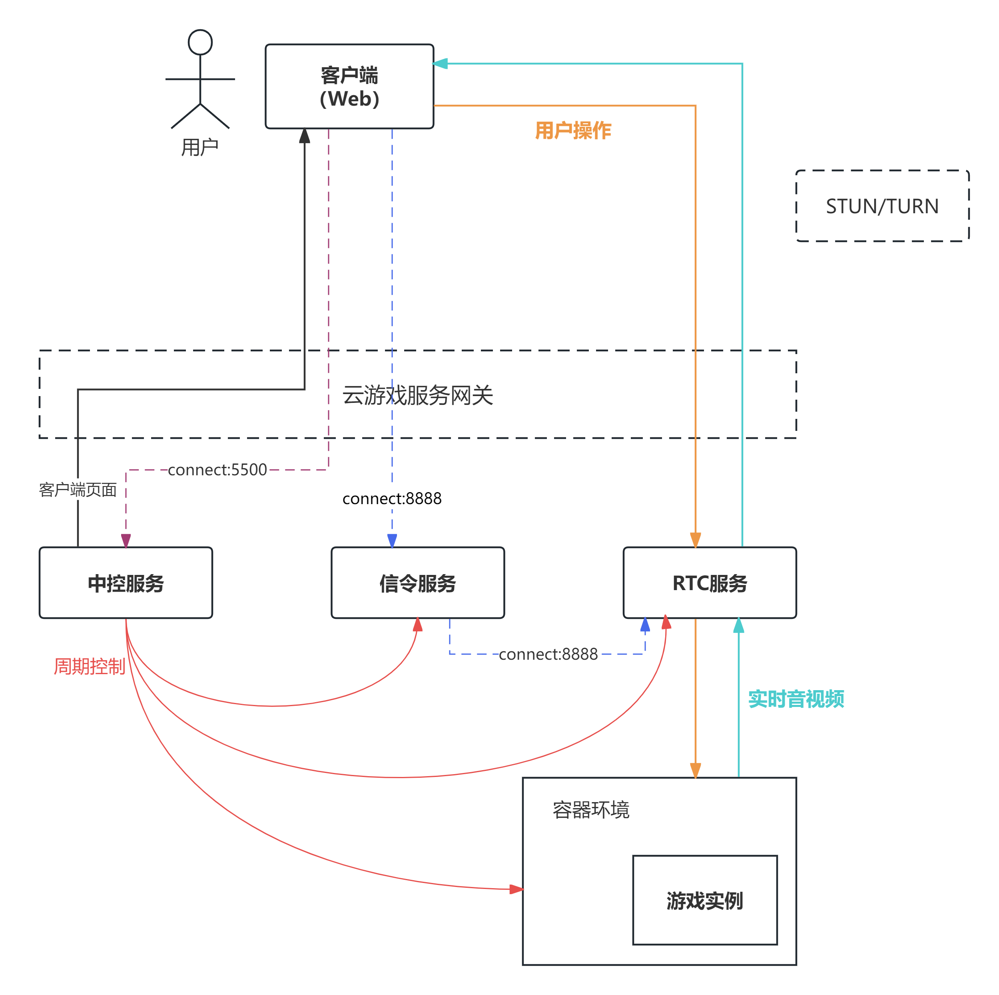
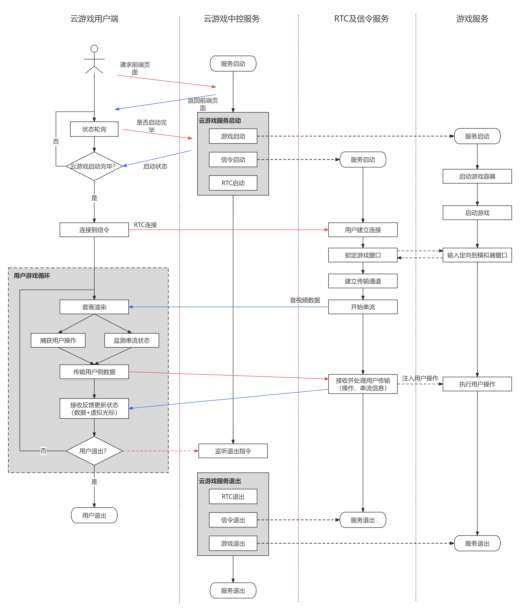

## RXiley's Cloud Game  
  
  XCloud是一个基于WebRTC的云游戏服务Demo，支持通过浏览器访问云游戏。目前由本人（RXiley）独立开发维护，项目主要包含了云游戏服务的控制逻辑，以及与RTC服务的交互逻辑。项目服务逻辑主要使用Go语言编写，前端页面使用简单的`Html + Js + Css`。RTC串流服务使用个人定制化修改的WebRTC服务端程序（属于本人的另一个项目），支持VP8、VP9、AV1、H264编码器。  
    
  当前项目依旧处于开发阶段（部分功能可靠性仍需测试，支持功能尚不全面），目前支持的功能有：  
  + 云游戏基础游玩功能：支持游戏的启动、关闭、控制（键盘、鼠标）等基本功能。
  + 云游戏串流服务：支持VP8、VP9、AV1、H264编码器，支持CBR、VBR模式编码。
  + 支持有玩的游戏：Windows游戏、安卓游戏（模拟器启动）。
  + 小窗口模式：支持小窗口模式，可以在浏览器中观看游戏画面，此时串流服务会进行降级，以节省流量。
  + 挂机功能：支持挂机功能，可以在游戏中挂机，期间串流服务会暂停，以节省流量。  
    
  视频演示：
  + [XCloud Demo演示01](https://www.bilibili.com/video/BV1rLV5eKEWo/)
  + [XCloud Demo演示02](https://www.bilibili.com/video/BV1p9b3eqEDf/)
  + [XCloud Demo演示03](https://www.bilibili.com/video/BV142b3eGEV1/)
### 1. 项目依赖  
#### 使用模拟器启动游戏（推荐）  
+ 安卓模拟器（推荐使用雷电模拟器或BlueStacks，`third_party`文件夹下提供了二者的安装包），以及**安装好想要运行的游戏**。  
+ adb工具，用于连接安卓模拟器，下载地址：[Android platform-tools](https://developer.android.com/studio/releases/platform-tools?hl=zh-cn)。
+ 配置adb环境变量，在Path中包含adb.exe所在目录。
  
#### 直接启动windows游戏
+ 安装指定的游戏（部分游戏可能会屏蔽按键消息，从而无法实现控制）。
  
### 2. 配置准备  
#### 配置项文件  
**config.json**  
在项目主目录下（或xcloud.exe相同目录下），创建config.json文件，其内容格式可以参考backup.json文件。其中各配置项含义如下（注意，以下选项如果注明无需配置，请保留字段名，然后置空字段值，或者直接使用`backup.json`中的默认值）：
+ `server` : 服务手动配置项
  + `server_ip` : 服务器IP设置，用于配置云游戏服务器所在IP地址，用于手动指定IP。如果该字段值为`""`，则程序会试图定位本机`ipconfig`中第一个可用的IP地址作为本机IP（**这并不一定总是正确的**）。
  + `server_port` : 默认服务器端口号是5500，目前该配置项不会被读取，如需修改请修改`front`配置项。
+ `game` : 游戏相关配置项。
  + `window_name` : 如果直接启动windows游戏，此选项代表游戏启动后的窗口名称，程序将根据此名称定位游戏并传输指令。如果使用模拟器启动，该代表游戏的名字，程序将根据此名字去`appconfig.json`中查询对应的启动选项。
  + `game_dir` : 如果直接启动windows游戏，此选项代表游戏的启动入口（通常是一个exe程序）。如果使用模拟器启动，该选项无需配置。
  + `game_need_boosting` ：开发中，无需配置。
+ `rtc` ：RTC服务相关配置。
  + `rtc_dir` : rtc程序的位置，通常指`peerconnection_client.exe`的位置。`third_party`文件夹下包含多个版本的`peerconnection_client.exe`，位于`vp9`和`av1`目录下（其中也包括使用vbr的版本），可以直接使用，也可以自行编译新的client然后指定位置。
  + `rtc_log_dir` : 开发中，目前RTC日志会输出到`D://rtclog`路径下。
  + `rtc_is_release` ：无需配置。
+ `signaling` ：信令服务配置。
  + `sig_port` : 信令服务端口号，默认为8888。目前由于RTC服务内端口还未实现自定义，此选项请固定为默认值。
+ `auth` : 开发中，无需配置，按原样式复制即可。
+ `front` ：中控服务（前端分发+页面交互）地址。
  + `front_address` : 中控服务监听地址，是云游戏服务的入口地址。
+ `simulator` : 模拟器配置。如果直接启动windows游戏则只需配置`enabled`为`false`。
  + `category` : 模拟器的窗口名，程序将根据此名称来定位模拟器和传输指令（eg. 在使用雷电模拟器时窗口名为`雷电模拟器`，使用蓝叠模拟器时窗口名为`BlueStacks`）。
  + `dir` : 模拟器启动路径（模拟器入口程序所在路径）。
  + `name` : 模拟器的ADB名称，一般ADB使用5555端口，所以大多数情况下模拟器名称会直接使用"127.0.0.1:5555"，不建议更改。
  + `enabled` ：是否使用模拟器启动游戏，程序将根据此配置项决定是使用模拟器还是直接启动windows游戏。
  
**appconfig.json**  
同时如果使用模拟器启动游戏，需要根据启动的具体游戏，在`appconfig.json`中写入对应游戏的启动选项。目前预置了《崩坏：星穹铁道》与《绝区零》（注意：绝区零启动需要使用雷电模拟器的Vulkan专版，请自行下载，或者尝试在普通版中安装后根据模拟器的跳转提示去进行配置）对应的安卓包启动选项（包名和主事件名）。如何查找APP对应的启动命令可以参考[Android adb启动任意app的几种方式](https://blog.csdn.net/ezconn/article/details/99885715) 。`appconfig.json`中可以包含多个游戏的启动选项。
+ `name` : 游戏名称，需要与`config.json`中的`game`字段中的`window_name`对应。
+ `package` ：游戏APP包名。获取方式参考上述链接。
+ `activity` : 游戏启动的主事件名。获取方式参考上述链接。
  
### 3. 云游戏服务  
#### 启动
1. 确保`config.json`、`appconfig.json`配置正确并且存在于项目主目录下。确保安卓模拟器上的游戏已经安装。
2. 运行`xcloud.exe`。
3. （如果二次开发）启动go程序。使用`go run .`或`go build .`然后运行`xcloud.exe`。

#### 访问
1. 用户如果要访问云游戏，需要访问配置于`front_address`中的地址，默认为":5500"。
2. 目前只支持单用户访问站点（游戏暂时不支持调度与多开）。
3. 由于云游戏服务的性质，请不要在同一终端机上启动服务与访问。

#### 停止
1. 目前停止逻辑为：在终端输入任意字符（或直接敲回车）即可退出服务，会停止所有云游戏相关服务，包括终止游戏以及关闭模拟器。

### 4. 服务依赖程序
本项目主要是实现云游戏的控制逻辑，所以具体的游戏服务和RTC支持需要依靠其他程序实现，在`third_party`目录下，包含了使用定制化webrtc编译的RTC程序和安卓模拟器的安装包（不提供游戏安装包，需要自行下载）。
+ `peerconnection_client.exe` ：RTC服务提供程序，负责串流与控制指令模拟（优先使用VP9编码器）。
+ `peerconnection_server.exe` ：RTC信令服务程序。
+ `BlueStacksMicroInstaller.exe` : 蓝叠模拟器(BlueStacks)安装包。
+ `ldplayer9_ld_112_ld.exe` : 雷电模拟器9安装包。
+ `av1/peerconnection_client.exe` : 优先使用AV1编码器的RTC服务提供程序，可以替代`peerconnection_client.exe`。AV1编码器可以为性能较好的设备提供更出色的编码效果。  

### 5. 注意事项  
+ 若使用模拟器，请确定开启了模拟器的ADB本地调试功能（雷电模拟器默认开启，蓝叠需要手动开启），并确认ADB端口号，一般默认是5555。
+ 由于模拟器默认的ADB端口都是5555，所以在没有自定义模拟器连接名的时候请**不要在云游戏服务时切换启动多个开启了ADB调试的模拟器**，这可能会导致ADB无法识别想要启动的模拟器从而导致无法自动拉起游戏进程（只能在客户端或者服务端手动点击）。若出现上述情况，请断开原有ADB连接并重试。
+ `peerconnection_client.exe`的串流服务只是指定了编解码偏好，具体使用的编解码标准取决于云游戏客户端（Web浏览器）的解码能力。
+ `third_party/av1`和`third_party/vp9`目录下包含了优先指定不同编码器的串流服务端，各自目录下的`./vbr`代表使用VBR（可变码率）模式编码的服务端，默认路径下的服务端采用的是CBR（恒定码率）模式编码。  

### 6. 项目结构  
项目结构图如下：  

项目核心流程图如下：

### 7. 目前已知问题  
+ 雷电模拟器的默认按键有时会导致客户端光标异常行为。  
  + 原因：雷电模拟器中部分默认按键映射以宏的形式定义，在映射点击动作后会强制呼出鼠标，导致双端鼠标动作不一致；
  + 影响范围：已知受到影响的有崩铁的部分操作，如地图快捷键（默认M）、背包快捷键（默认B）等，如果使用雷电模拟器自带的按键映射方案，可能会出现问题；
  + 解决方案：统一双端行动模型，在模拟器中不使用呼出鼠标的按键映射，或在客户端中增加对应的动作模组映射。
+ 客户端按键冲突。
  + 目前前端浏览器页面没有对冲突快捷键进行过滤，可能会导致部分按键组合会触发浏览器行为导致未知效果（如Ctrl键+某些字母）。
+ 绝区零支持需要使用雷电模拟器的Vulkan专版。
  + 原因：绝区零使用了Vulkan渲染技术，而雷电模拟器的普通版不支持Vulkan，所以需要使用雷电模拟器的Vulkan专版。
  + 解决方案：下载雷电模拟器的Vulkan专版，然后在模拟器中安装绝区零，根据模拟器的跳转提示进行配置。